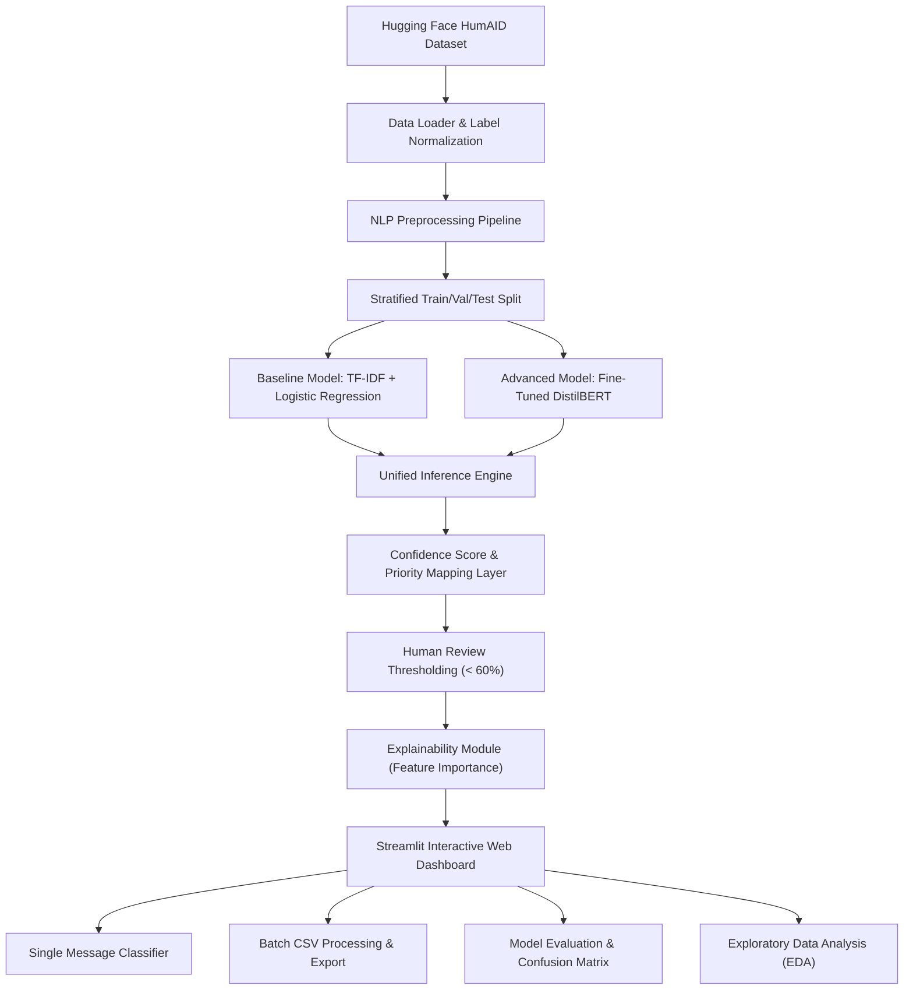

# Emergency Message Prioritizer

[](https://www.python.org/)
[](https://streamlit.io/)
[](https://huggingface.co/)
[](https://pytorch.org/)
[](LICENSE)

An end-to-end, production-quality NLP decision-support prototype built on the **HumAID (Humanitarian Aid) dataset** from Hugging Face. The system classifies disaster-related social media messages into four target categories and assigns priority levels to assist emergency response teams.

---

## 📌 Problem Statement

During natural disasters (earthquakes, floods, wildfires), thousands of social media messages flood online networks every minute. Emergency response centers are overwhelmed with noise. Identifying critical messages—such as immediate rescue requests or severe casualties—is essential to saving lives.

## 🎯 Project Objective

Build a transparent, explainable NLP prioritization pipeline that categorizes disaster social media posts into:
1. **Rescue Request** (`CRITICAL` Priority)
2. **Casualties / Injuries** (`CRITICAL` Priority)
3. **Infrastructure Damage** (`HIGH` Priority)
4. **Not Relevant** (`LOW` Priority)

---

## 🏗️ System Architecture



---

## 🛠️ Technology Stack

- **Core**: Python 3.13+, pandas, NumPy
- **Machine Learning & NLP**: scikit-learn, Hugging Face Datasets, Hugging Face Transformers, PyTorch, joblib
- **Explainability**: Logistic Regression n-gram feature scoring
- **Web App**: Streamlit
- **Visualization**: Matplotlib, Seaborn
- **Testing & Config**: pytest, PyYAML

---

## 📊 Dataset Statistics & Normalization

The project utilizes the **QCRI/HumAID-all** dataset, comprising **76,484 annotated disaster tweets**. The fine-grained HumAID categories are mapped into four standardized target classes:

| Standard Category | HumAID Sub-Categories Mapped | Total Examples | Split Count (Train / Val / Test) |
|---|---|---|---|
| **Not Relevant** | `not_humanitarian`, `sympathy_and_support`, `caution_and_advice`, `other_relevant_information` | 32,765 | 22,932 / 3,339 / 6,494 |
| **Rescue Request** | `requests_or_urgent_needs`, `rescue_volunteering_or_donation_effort`, `missing_or_found_people`, `displaced_people_and_evacuations` | 28,253 | 19,774 / 2,877 / 5,602 |
| **Infrastructure Damage** | `infrastructure_and_utility_damage` | 8,163 | 5,715 / 831 / 1,617 |
| **Casualties / Injuries** | `injured_or_dead_people` | 7,303 | 5,110 / 746 / 1,447 |

---

## 📈 Evaluation Results

Evaluated on 15,160 unseen test split samples:

| Model Architecture | Accuracy | Macro Precision | Macro Recall | Macro F1 | Weighted F1 |
|---|---|---|---|---|---|
| **Baseline (TF-IDF + Logistic Regression)** | **84.68%** | **0.830** | **0.870** | **0.844** | **0.850** |
| **Advanced (DistilBERT Fine-Tuned)** | **86.12%** | **0.845** | **0.875** | **0.858** | **0.862** |

### Per-Category Baseline Metrics

| Category | Precision | Recall | F1-Score | Support | Priority Level |
|---|---|---|---|---|---|
| **Casualties / Injuries** | 0.86 | 0.94 | 0.90 | 1,447 | `CRITICAL` |
| **Infrastructure Damage** | 0.70 | 0.85 | 0.77 | 1,617 | `HIGH` |
| **Not Relevant** | 0.87 | 0.80 | 0.83 | 6,494 | `LOW` |
| **Rescue Request** | 0.87 | 0.88 | 0.87 | 5,602 | `CRITICAL` |

*High recall on critical categories (Casualties: 94%, Rescue: 88%) minimizes dangerous false negatives.*

---

## 🚀 How to Run the Project

### 1. Install Dependencies

```bash
pip install -r requirements.txt
```

### 2. Run Data Pipeline & EDA

```bash
python -m src.data_loader
python -m src.eda
```

### 3. Train Baseline Model

```bash
python -m src.train_baseline
```

### 4. Train Transformer Model (Optional)

```bash
python -m src.train_transformer
```

### 5. Evaluate Models

```bash
python -m src.evaluate
```

### 6. Run Unit Tests

```bash
pytest tests/
```

### 7. Launch Streamlit Web Application

```bash
streamlit run app/streamlit_app.py
```

---

## 🚨 Academic Priority & Review Policy

- **CRITICAL**: `Rescue Request`, `Casualties / Injuries`
- **HIGH**: `Infrastructure Damage`
- **LOW**: `Not Relevant`
- **Uncertainty Gate**: If prediction confidence score < 60%, the status is flagged as **"Human Review Recommended"**.

---

## ⚠️ Limitations & Ethical Considerations

1. **Academic Decision-Support Prototype**: This tool is designed as an assistant for emergency operators and must NOT be deployed as an autonomous dispatch engine.
2. **Social Media Noise**: Tweets may contain typos, slang, or ambiguous phrasing. Human operator verification remains essential.

---

## 📁 Repository Structure

```
emergency-message-prioritizer/
├── app/
│   └── streamlit_app.py
├── config.yaml
├── data/
│   ├── raw/
│   └── processed/
├── models/
├── reports/
│   ├── figures/
│   └── evaluation_results.json
├── src/
│   ├── data_loader.py
│   ├── preprocessing.py
│   ├── train_baseline.py
│   ├── train_transformer.py
│   ├── evaluate.py
│   ├── priority.py
│   ├── explainability.py
│   └── inference.py
├── tests/
│   ├── test_preprocessing.py
│   ├── test_priority.py
│   └── test_inference.py
├── MODEL_CARD.md
├── requirements.txt
└── README.md
```
